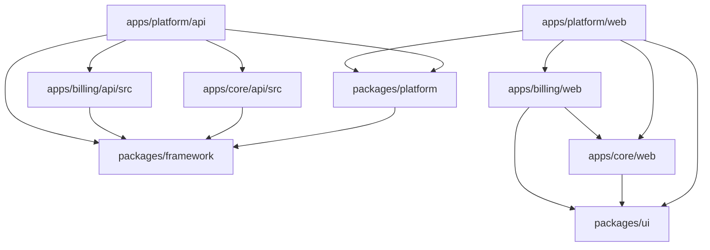

# Module Boundaries

## Module Definition

A CODEXSUN module is a business or platform capability with its own boundaries, contracts, configuration, and lifecycle.

Examples:

- Billing.
- Accounting.
- Inventory.
- Garments.
- uPVC.
- Offset Printing.
- POS.
- Mail.
- Tasks.
- WhatsApp Integration.
- Offline Sync.
- ZERO Assistant.

## Module Responsibilities

Each module should define:

- Purpose.
- Owned entities.
- Owned tables.
- Public APIs.
- Events published.
- Events consumed.
- Permissions.
- Feature flags.
- Tenant settings.
- Sync behavior.
- Reports.
- UI routes.
- Test scope.

## Composition and HTTP Contracts

Module definitions use the framework's typed `defineModule<TDependencies>()` contract.
The module's `register(dependencies)` function receives only declared dependencies from
the app composition root; hidden imports of application singletons are not allowed.

New or materially changed HTTP endpoints must use `registerContractRoute()` with Zod
schemas for request inputs and successful response data. Do not cast `request.body`,
`request.params`, or `request.query` directly in a contract route. Return domain data
from its handler and let the framework create the standard API envelope.

## Standard Module Folder Structure

Modules must use one module folder with NestJS-like filenames. Do not create many nested boundary folders inside a module.

```text
apps/{app}/api/src/modules/{module}/
  {module}.module.ts       # Module definition and registration
  {module}.service.ts      # Use cases and business operations
  {module}.repository.ts   # Database adapter and persistence implementation
  {module}.routes.ts       # HTTP/interface layer
  {module}.events.ts       # Event names, publishers, subscribers, and handlers
  {module}.migration.ts    # Module-specific database migrations
  {module}.worker.ts       # Queue registration and background job processors
  {module}.seed.ts         # Default data and seed behavior
  {module}.sync.ts         # Offline and sync rules
  {module}.types.ts        # Public types and contracts
  index.ts                 # Public exports
```

Example:

```text
apps/billing/api/src/modules/quotation/
  quotation.module.ts
  quotation.service.ts
  quotation.repository.ts
  quotation.routes.ts
  quotation.events.ts
  quotation.migration.ts
  quotation.worker.ts
  quotation.seed.ts
  quotation.sync.ts
  quotation.types.ts
  index.ts
```

This structure keeps module code easy to scan while preserving clear roles. It replaces folder-heavy patterns such as `application/index.ts`, `contracts/index.ts`, `domain/index.ts`, `infrastructure/index.ts`, and similar nested placeholders.

Full modules must contain every role above. Do not add empty role files to make the folder look complete. Each file must expose callable, testable behavior for its role. A deliberately smaller module must declare its capability exemptions in `{module}.module.ts`; undocumented omissions are boundary failures.

### Core Common Reduced Modules

Core Common leaf masters deliberately use a reduced eight-file backend boundary:

```text
{module}.migration.ts
{module}.module.ts
{module}.repository.ts
{module}.routes.ts
{module}.seed.ts
{module}.service.ts
{module}.types.ts
index.ts
```

Each reduced Common module must own concrete migration SQL, repository queries, service validation, HTTP routes, lifecycle behavior, seeds, and types. Shared factories, generic inherited repositories/services, alias wrappers, and metadata definitions do not satisfy these roles. These synchronous CRUD masters must not carry separate metadata-only definition, event, sync, or worker files. If a Common module later gains real event, offline-sync, or background-job behavior, promote it to the full module contract when that behavior is implemented.

### Mandatory Boundary Audit For Every Application

The same ownership discipline applies to Core, Platform, Billing, and every future application. Before an application change is finalized, audit its complete backend and frontend module tree for wrapper/alias roles, inherited or metadata-driven generic CRUD, private cross-module imports, centralized business implementations, stale exports and proxies, misplaced files, and business behavior stored in app-level shared folders. Composition roots contain registration and lifecycle composition only; leaf modules own executable behavior.

Allowed shared infrastructure is narrow: API transport/session context, environment readers, observability, and reusable `@codexsun/ui` controls. Shared code must not know a business module's fields, validation, tables, lifecycle, routes, forms, lists, workspaces, settings, or print behavior.

Run `node tools/check-module-boundaries.mjs <app>` for the changed application, followed by formatting, lint, TypeScript, production composition/build validation, and any configured database/E2E checks. A new application is incomplete until the boundary checker understands and enforces its approved full or reduced contract.

Strict naming rules:

- Use the module name as the filename prefix, for example `quotation.service.ts`, not `service.ts`.
- Use singular role names: `migration.ts`, `worker.ts`, `seed.ts`, `sync.ts`, and `types.ts`.
- Keep public exports in `index.ts`.
- Keep queue registration and worker processors together in `{module}.worker.ts` unless the module becomes large enough to justify a later explicit split.
- Use `routes.ts` for HTTP/interface code. Do not use a vague `interface.ts` filename for routes.
- Use `types.ts` for public contracts and shared module types. Do not create a separate `contracts/` folder.
- `events.ts` defines event names, typed envelopes, and event construction or handling behavior. A constant map alone is incomplete.
- `worker.ts` defines supported jobs and executable dispatch/processor behavior. Empty queue arrays and future-reservation metadata are incomplete.
- `sync.ts` defines scope, direction, conflict policy, cursor/checkpoint behavior, and a callable decision or normalization function. An `offline` boolean alone is incomplete.
- `seed.ts` and `migration.ts` provide callable persistence behavior. Description-only objects are incomplete.
- `index.ts` is the only public barrel. Other modules import through it unless a composition root needs a specific lifecycle function.

### Role Behavior Contract

| File                     | Required behavior                                                                 |
| ------------------------ | --------------------------------------------------------------------------------- |
| `{module}.module.ts`     | Stable key, scope/capabilities, and registration/composition function             |
| `{module}.service.ts`    | Business use cases and validation orchestration                                   |
| `{module}.repository.ts` | Owned persistence reads/writes with tenant/platform scope                         |
| `{module}.routes.ts`     | Thin HTTP handlers that call the service and return structured responses          |
| `{module}.events.ts`     | Typed event names, envelope construction, and handlers/subscribers when consumed  |
| `{module}.migration.ts`  | Callable, idempotent table/index migration owned by the module                    |
| `{module}.worker.ts`     | Typed job names, retry/idempotency policy, and executable dispatch                |
| `{module}.seed.ts`       | Callable, repeatable seed behavior or an explicit tested no-data policy           |
| `{module}.sync.ts`       | Explicit sync scope/direction/conflict policy and callable sync decision behavior |
| `{module}.types.ts`      | Public DTOs, commands, results, event/job/sync contracts                          |
| `index.ts`               | Intentional public API only                                                       |

## Standard App Source Structure

Business apps use an `api/` workspace for the runnable backend and keep backend/module source under
that package's `src/`; frontend source remains in the sibling `web/` workspace.

```text
apps/
  platform/
    api/              # Runnable platform API gateway/composition surface
    web/              # Runnable platform shell and route composer

  core/
    api/              # Runnable Core API; owned source lives under api/src
    web/              # Core frontend modules

  billing/
    api/              # Runnable Billing API; owned source lives under api/src
    web/              # Billing frontend modules

  crm/
    src/              # CRM backend modules
    web/              # CRM frontend modules

```

The Platform API owns gateway/composition, auth, tenant context, RBAC, app registry, and shared
runtime wiring. A business app API owns its domain modules and exposes only intentional package and
HTTP contracts; the `api` package name never permits business behavior in its composition root.

Business app `api/src/` roots must remain flat:

```text
apps/{app}/api/src/
  index.ts
  modules/
```

Routes, migrations, workers, seeders, sync rules, contracts, repositories, and use cases must live under `src/modules/{module}/` using the module-prefixed filenames above. Package subpaths may point at module exports for compatibility, but source folders such as top-level `api/`, `migrations/`, `queues/`, `seeders/`, `sync/`, and `workers/` should not be recreated.

Frontend ownership follows the same boundary:

- `apps/platform/web` owns the shell, login, SA/admin desks, tenant desk layout, global navigation, activation, and route composition.
- `apps/core/web` owns common/master tenant screens and shared tenant data UI.
- `apps/billing/web` owns billing entries, billing settings, billing reports, and billing forms.
- `apps/crm/web` owns its own app-specific screens and routes.
- `packages/ui` owns reusable design-system primitives only. It must not absorb app-specific business screens or rules.

Runnable app web packages use `apps/{app}/web/src/modules/{module}/` for app-owned frontend workflows:

```text
apps/{app}/web/src/
  modules/
    {module}/
      index.ts
      {module}.list.tsx
      {module}.form.tsx
      {module}.workspace.tsx
      {module}.services.ts
      {module}.hooks.ts
      {module}.types.ts
      {module}.schema.ts
      {module}.settings.tsx
      {module}.print.tsx
  shared/
```

Shared controls and layout primitives belong in `packages/ui`. Cross-module app-web code belongs in `web/src/shared`. Business-specific page state, forms, lists, document settings, print UI, and workflow composition stay in the owning app web module under `web/src/modules/{module}`.

Within a frontend module, API calls go in `{module}.services.ts`, custom hooks go in `{module}.hooks.ts`, Zod schemas go in `{module}.schema.ts`, and interfaces/types go in `{module}.types.ts`. Page components should consume those files instead of calling shared APIs directly when the behavior belongs to that module.

Frontend role behavior is strict:

- `{module}.workspace.tsx` owns view state and composes list/show/upsert flows.
- `{module}.list.tsx` renders the real list, loading, empty, filter, pagination, and row-action states. It must not only rename or re-export the workspace.
- `{module}.form.tsx` renders the real form controls, validation state, and submit/cancel actions. It must not only rename or re-export the workspace.
- `{module}.services.ts` owns all module API calls.
- `{module}.hooks.ts` owns TanStack Query/mutation integration and cache keys.
- `{module}.schema.ts` owns executable input validation and inferred form types.
- `{module}.types.ts` owns frontend contracts and view models.
- `index.ts` exposes the intentional module surface.

All full CRUD modules must have the same required file level on backend and frontend. Gallery, shell-only, or composition-only modules may be smaller only when their exemption is explicit and they do not pretend to be full CRUD modules.

Read-only Billing report leaves under `apps/billing/api/src/modules/reports/{report}/` own `module`, `repository`, `service`, `routes`, and `types` roles plus `index.ts`; they do not create fake migrations, seeds, events, workers, or sync roles. Their frontend leaves under `apps/billing/web/src/modules/reports/{report}/` own report-specific filters in the form/schema roles together with services, hooks, list, workspace, types, page, and public exports.

## Module Contract

Every module should have an explicit contract.

The contract should answer:

- What can other modules ask this module to do?
- What data can other modules read?
- What events does this module publish?
- What events does this module listen to?
- What configuration does this module require?
- What happens when this module is disabled?

## Plug-And-Play Behavior

Modules should support activation and deactivation through tenant configuration.

Tenant and industry activation must stay explicit. A module may be platform-scoped, tenant-scoped, industry-scoped, or integration-scoped, but tenant runtime access must still pass tenant context, active tenant checks, feature/module activation checks, permission checks, and tenant-owned data access.

When a module is activated:

- Required permissions are registered.
- Routes become available.
- Menus become visible.
- Background jobs are scheduled if needed.
- Settings are initialized.
- Required migrations are applied.

When a module is deactivated:

- New actions are blocked.
- Existing records remain available if required by compliance.
- Scheduled jobs stop where safe.
- Reports handle historical data correctly.

## Shared Kernel

Only very stable concepts should enter the shared kernel.

Possible shared concepts:

- Tenant ID.
- User ID.
- Money.
- Date range.
- Address.
- Tax identifier.
- Document number.
- Audit metadata.

Do not put unstable business rules in the shared kernel.

---

## Boundary Review (Task 17 — June 2026)

### App Boundaries (Physical)

| App/Package            | Role                              | Owns                                                                                                                                                       |
| ---------------------- | --------------------------------- | ---------------------------------------------------------------------------------------------------------------------------------------------------------- |
| `packages/framework`   | Shared kernel                     | DB abstraction, HTTP helpers, errors, modules registry, health check, testing utilities                                                                    |
| `packages/platform`    | Platform services                 | Auth, tenants, audit, settings, permissions, roles, subscription (scaffold), users, catalog, notifications, files, activity, agents, templates, API client |
| `packages/ui`          | Design system                     | React components, layouts, workspace patterns, blocks (sidemenu, tables, forms)                                                                            |
| `apps/core/api/src`    | Master/business backend modules   | Common definitions, contacts, companies, and products with database-backed tenant records; work orders and generic core records remain temporary           |
| `apps/core/web`        | Core frontend modules             | Common/master tenant screens, lookup controls, and reusable tenant record workspace UI                                                                     |
| `apps/billing/api/src` | Billing backend modules           | Quotation, sales, export sales, purchase, receipt, payment contracts, routes, migrations, workers, seeders, and sync rules under module folders            |
| `apps/billing/web`     | Billing frontend modules          | Billing entry workspaces, billing settings, billing forms, and billing reports                                                                             |
| `apps/mail/api`        | Mail backend module               | Tenant mail settings, encrypted credentials, messages, attachments, delivery/sync events, SMTP/IMAP workers, and queue contracts                           |
| `apps/mail/web`        | Mail frontend module              | Mailboxes, rich compose, provider settings, message reader, and public Billing document-mail integration                                                   |
| `apps/platform/api`    | API gateway + platform routes     | Route registration, guard functions (session, tenant, feature, permission), migration runner, DB bootstrap                                                 |
| `apps/platform/web`    | Platform shell and React composer | Login, SA desk, Admin desk, Tenant desk shell, design system pages, route/menu composition, API client integration                                         |

### Table Ownership

**Master Database (cxsun_master_db) — owned by `apps/platform/api`:**

| Table                      | Owner                  | Purpose                      |
| -------------------------- | ---------------------- | ---------------------------- |
| `super_admin_users`        | platform.users         | SA authentication            |
| `staff_users`              | platform.users         | Staff authentication         |
| `tenants`                  | platform.tenants       | Tenant registry              |
| `tenant_databases`         | platform.tenants       | Per-tenant database tracking |
| `tenant_domain_mappings`   | platform.tenants       | Custom domain binding        |
| `audit_events`             | platform.audit         | All audit records            |
| `sessions`                 | platform.auth          | Session store                |
| `platform_modules`         | platform.catalog       | Module registry              |
| `tenant_module_activation` | platform.catalog       | Per-tenant module state      |
| `platform_settings`        | platform.settings      | Key-value settings store     |
| `platform_feature_flags`   | platform.settings      | Feature toggles              |
| `file_metadata`            | platform.files         | File registry                |
| `notification_records`     | platform.notifications | Notification queue           |
| `agent_action_audits`      | platform.agents        | Agent execution log          |
| `activity_timeline`        | platform.activity      | Business activity feed       |
| `comments`                 | platform.activity      | Record-level comments        |

**Tenant Databases — owned by tenant apps (future):**

| Table                 | Owner                       | Purpose                                                         |
| --------------------- | --------------------------- | --------------------------------------------------------------- |
| `users`               | Platform (tenant bootstrap) | Tenant user auth                                                |
| `tenant_audit_events` | Platform (bootstrap)        | Tenant-scoped audit                                             |
| `mail_settings`       | Mail                        | Company-scoped provider configuration and encrypted credentials |
| `mail_messages`       | Mail                        | Inbox, draft, queue, sent, failed, and trash message state      |
| `mail_attachments`    | Mail                        | Tenant mail attachment payloads and metadata                    |
| `mail_events`         | Mail                        | Delivery, failure, sync, and lifecycle history                  |

### Package Dependency Direction



Key rule: `packages/platform` depends on `packages/framework` **only**. `apps/core` depends on `packages/framework` **only**. `apps/billing` owns entries and consumes core through injected contracts/UI composition, not direct platform code. Platform API is the integration point where `platform`, `core`, `billing`, and future apps are composed.

### App Suite Bundles

| Bundle           | Includes                                                        | Purpose                                                                 |
| ---------------- | --------------------------------------------------------------- | ----------------------------------------------------------------------- |
| Base SaaS        | shared packages + `framework` + `platform` + `core`             | Tenant, identity, RBAC, common modules, contacts, products, work orders |
| Billing Software | shared packages + `framework` + `platform` + `core` + `billing` | Entry billing with industry feature flags and document settings         |
| CRM Suite        | shared packages + `framework` + `platform` + `core` + `crm`     | CRM app with shared identity, tenant, and core customer data foundation |

Billing industry fields must stay as billing settings/features. Examples: offset billing uses PO/DC, garments uses colour/size, uPVC can add length/width/area later. Shared billing fields remain particulars, quantity, price, GST, subtotal, totals, and document controls.

### Migration Verification

- **001_master_foundation**: Creates tenant, SA, staff, database tables. ✓ Applied.
- **002_master_audit_sessions**: Creates audit_events, sessions. ✓ Applied.
- **003_master_platform_catalog**: Creates platform_modules, tenant_module_activation. ✓ Applied.
- **004_master_settings_files_notifications**: Creates settings, features, files, notifications, agents, activity, comments. ✓ Applied.
- **Bootstrap tenant migration**: Creates tenant-local `access_*`, `module_settings`, and `schema_migrations` tables; master audit events remain in `tenant_audit_events`. ✓ Applied.

All 5 migration units pass initialization and run cleanly. Migration runner tracks state in `platform_migrations` table.

### Task 14 Artifact Cleanup

| Artifact                                                                                | Action                                              | Status   |
| --------------------------------------------------------------------------------------- | --------------------------------------------------- | -------- |
| `packages/platform/src/master-data/`                                                    | Removed (entire dir)                                | ✓ Done   |
| `apps/platform/api/src/master-data/routes.ts`                                           | Removed                                             | ✓ Done   |
| `apps/platform/api/src/__tests__/master-data.test.ts`                                   | Removed (replaced by core-routes.test.ts)           | ✓ Done   |
| `packages/platform/src/index.ts` — master-data export                                   | Removed                                             | ✓ Done   |
| `apps/platform/api/src/app.ts` — master-data imports/services/decorations/routes        | Removed                                             | ✓ Done   |
| `packages/platform/src/catalog/contracts.ts` — `business.master-data` entry             | Removed                                             | ✓ Done   |
| `packages/platform/src/permissions/contracts.ts` — `business.master-data.*` permissions | Removed                                             | ✓ Done   |
| `apps/platform/web/src/pages/TenantDesk.tsx` — master-data nav items                    | Removed                                             | ✓ Done   |
| `apps/platform/web/src/pages/tenant/MasterDataPage.tsx`                                 | Retained (read-only reference, no route dependency) | Retained |
| `apps/platform/web/src/pages/tenant/MasterRecordsPage.tsx`                              | Retained (read-only reference, no route dependency) | Retained |

### Module Catalog (Updated)

Current registered modules in `platformModuleCatalog`:

| Module Key               | Scope    | Status                      |
| ------------------------ | -------- | --------------------------- |
| `platform.tenants`       | platform | Active                      |
| `platform.users`         | platform | Active                      |
| `platform.roles`         | platform | Active                      |
| `platform.permissions`   | platform | Active                      |
| `platform.activation`    | platform | Active                      |
| `platform.audit`         | platform | Active                      |
| `platform.settings`      | platform | Active                      |
| `platform.notifications` | platform | Active                      |
| `core`                   | tenant   | Active (common definitions) |
| `core.contact`           | tenant   | Active                      |
| `core.company`           | tenant   | Active                      |
| `core.product`           | tenant   | Active                      |
| `business.items`         | tenant   | Future                      |
| `business.billing`       | tenant   | Active (entry modules)      |
| `business.accounting`    | tenant   | Planned                     |
| `business.reports`       | tenant   | Future                      |
| `business.offline-sync`  | tenant   | Future                      |
| `app.zetro`              | tenant   | Future                      |
| `app.mail`               | tenant   | Future                      |
| `app.blog`               | tenant   | Future                      |

### Boundary Decisions

1. **Core owns master data** — All common definitions, contacts, companies, and products live in `apps/core`. Platform no longer has master-data routes.
2. **Platform owns platform operations** — Tenants, users, audit, settings, auth remain in `packages/platform` + `apps/platform/api`.
3. **API gateway is the integration point** — `apps/platform/api/src/app.ts` wires together platform, core, billing, and future app services. Core routes get `/core/*`; billing routes get `/billing/*` with temporary `/core/entries/*` compatibility.
4. **Database-backed master records are required** — Common records, contacts, companies, and products are persisted in the master database with tenant scoping. Remaining temporary in-memory modules must not be promoted to production until they have explicit tables and bootstrap repair.
5. **No direct core-to-platform dependency** — Core only depends on `packages/framework`. Platform guards are injected via `CoreRouteContext` at API registration time.
6. **Subscription is scaffold-only** — The `SubscriptionService` class exists but has no real implementation. Paid-plan enforcement is deferred.
7. **Industry scoping is defined but not implemented** — `ModuleScope` includes `"industry"` but no industry modules or tables exist yet.
8. **GST/ZETRO are placeholders** — Tax identity types and HSN codes exist in core contracts; full compliance APIs and ZETRO assistant are future work.

9. **Business apps use strict backend/frontend module folders** - Runnable business backends use `api/src/index.ts` plus `api/src/modules/`; frontend modules remain under the app's `web` workspace. The API composition root registers modules but does not own business behavior.
10. **Platform web composes app web packages** - `apps/platform/web` remains the shell and route/menu composer. Business screens must live in the owning app web package and be imported or registered through app manifests.

Current runtime composition supersedes the earlier gateway wording in decision 3: Platform, Core,
and Billing run as app-owned API packages. Product stacks start selected APIs
in dependency order and integrate through public contracts, injected dependencies, or approved
events; Platform does not absorb another app's business routes or CRUD.

### Tenant Readiness Tracking

`assist/architecture/tenant-readiness-track.md` is the source of truth for current multi-tenant, multi-database, multi-industry, and multi-company readiness. Update it whenever tenancy enforcement moves forward or a new blocker appears.
